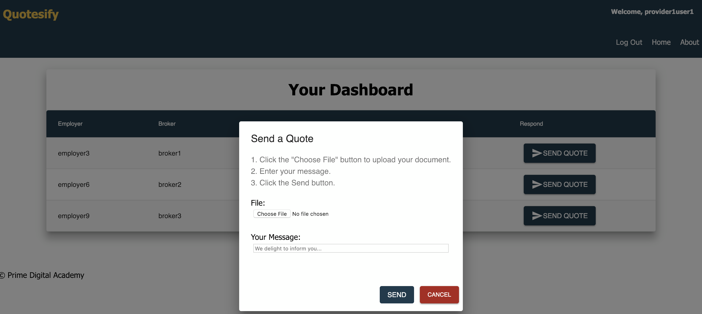

# Quotesify
This is a tool that helps insurance companies, brokers, and employers do business with one another. This app will manage employee data securely and simplify the process for employers to apply for health insurance packages.

## Built With

* Node
* Express
* React
* Redux
* Redux-Saga
* Passport.js
* SQL
* Google Firebase

## Getting Started

### Prerequisites

Before you get started, make sure you have the following software installed on your computer:

- Download or clone the code from this project's repository
- [Node.js](https://nodejs.org/en/)
- [PostrgeSQL](https://www.postgresql.org/)
- [Postico](https://eggerapps.at/postico/)
- [Nodemon](https://nodemon.io/)
- [Homebrew](https://brew.sh/)

### Nodemailer Setup:
Allows for an email to be sent to users as they are registered.

1. create .env file
2. Copy and paste into .env and replace the indicated:
    * YOUR_EMAIL_ADDRESS= REPLACE_WITH_YOUR_EMAIL_ADDRESS_HERE
    * PASSWORD_FOR_EMAIL= REPLACE_WITH_YOUR_EMAIL_ACCOUNT_PASSWORD_HERE

### Firebase Setup:
1. Set up a Google Firebase account. When that is done, click the ‘Add Project’ box from your Firebase console. Name your project and select the checkbox at the bottom to accept the controller-controller terms.
2. Click the `</>` button to access your configuration settings. If you cannot find this icon on your project’s home screen, click the gear icon at the top left of the page and choose Project Settings. From here you will see the `</>` button. Copy the configuration code that is in the pop up box.
3. Open the application’s code in your code editor and paste the copied code from Firebase to the config.js file located in the firebase folder. Replace any code that is already present in this file, but DO NOT edit or overwrite the last five lines of written code.
4. In the same firebase folder, create a new file named api_key.js then type let api_key=“YOUR API KEY GOES HERE”; export default api_key;
5. Copy the apiKey from the Firebase configuration code (i.e. the long line of random characters following the colon - make sure to include the quotations)
6. “YOUR API KEY GOES HERE” inside of api_key.js needs to be replaced with the apiKey that you just copied from Firebase in step #10. 
7. Now, navigate to your Firebase Storage. This can be found on the menu panel on the left side of the page. Click the Rules tab at the top and delete line 4 from the code that they provide. Replace it with the following line of code: allow read, write: if true;
8. Your application is now synchronized with your Firebase Storage.

### Create Database
* Create a PostgreSQL database named `quotesify_database` in Postico.

### Install Dependencies & Run the Application
1. Run `npm install`
2. Start postgres if not running already by using `brew services start postgresql`
3. Run `npm run server`
4. Run `npm run client`

### Use The App
* Once the app loads with `npm run client`, click on the `About` button at the top of the page
* Click on the `Add Demo Data` button and this will populate Postgresql with the appropriate information.
* NOTE: If no data is displaying anywhere on the app, copy and paste the contents of database2.sql into the SQL Query section of Postico and execute it all at once. Make sure that this is done in the database named `quotesify_database`

## App Page Screen Shots
### About Page

### Login Page

### Admin Page

### Employer Dashboard Page

### Employer Dashboard Upload CSV Page

### Employer Dashboard Upload CSV Organization Table

### Employer Dashboard Provider Quote Status Table

### Broker Clients Page

### Broker Quotes Page

### Provider Dashboard Page

### Provider Dashboard Page

### Software Engineers On This Project
- [Dick Polipnick](https://github.com/dpolipnick)
- [Jessica Stephens](https://github.com/jeslstep)
- [Malik Glass](https://github.com/Malik-G)
- [Peter Midthun](https://github.com/petermidthun)
- [Thomas Angelo Pinataro](https://github.com/thomasangelop)
